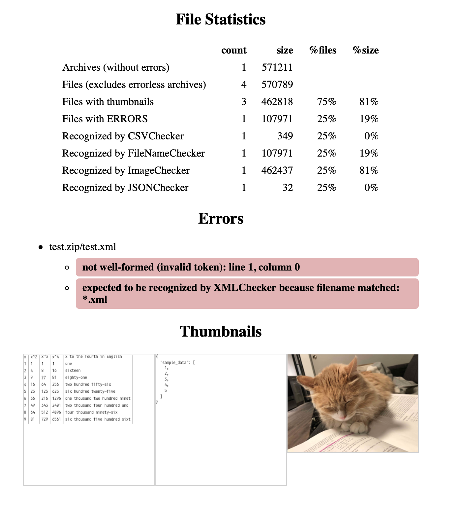

# spot\_check\_files

This is a tool to help validate the integrity of a set of files, e.g. data backups/exports.

- Checks recognized file types for errors, e.g. invalid json.
- Generates thumbnails of files when possible.
- Displays statistics about file types and unrecognized files.

It produces a report like the following in the terminal (seeing images in the terminal requires iTerm2):


Or [as HTML](doc/sample-out.html):



## Usage

Install:

1. Install python3 and pip
2. `pip3 install spot_check_files[imgcat]`
    - imgcat is optional and enables support for displaying thumbnails in iTerm2 on OS X

Run:

```bash
spotcheck PATH
```

This will output basic stats and any errors the tool detects in the given files/directories.
If you're using iTerm2 on Mac, it will also show thumbnails of files.

Alternatively, you can generate an HTML report:

```bash
spotcheck -H PATH > out.html
```

The full list of options can be seen [here](doc/usage.txt) or by running `spotcheck --help`.

This tool can also be used programmatically.
The main entry point for the library is the `CheckerRunner` class in [spot_check_files.checker](src/spot_check_files/checker.py).
You can add support for new file types by subclassing the `Checker` class from that module.

## Supported file types

The command-line tool currently relies entirely on file extension to determine file types.

<table>
    <thead>
        <tr>
            <th>Type</th>
            <th>Support</th>
        </tr>
    </thead>
    <tbody>
        <tr>
            <td>
                Archive files:
                <ul>
                    <li><code>.tar</code></li>
                    <li><code>.tar.bz2</code></li>
                    <li><code>.tar.gz</code></li>
                    <li><code>.tar.xz</code></li>
                    <li><code>.tbz</code></li>
                    <li><code>.tgz</code></li>
                    <li><code>.txz</code></li>
                    <li><code>.zip</code></li>
                </ul>
            </td>
            <td>Recursively checks all the files in the archive (including other archives)</td>
        </tr>
        <tr>
            <td>
                CSV files:
                <ul>
                    <li><code>.csv</code></li>
                    <li><code>.tsv</code></li>
                </ul>
            </td>
            <td>Checks that the CSV dialect can be detected and read by Python, and builds a thumbnail</td>
        </tr>
        <tr>
            <td>
                Image files:
                <ul>
                    <li><code>.bmp</code></li>
                    <li><code>.gif</code></li>
                    <li><code>.icns</code></li>
                    <li><code>.ico</code></li>
                    <li><code>.jpg</code></li>
                    <li><code>.jpeg</code></li>
                    <li><code>.png</code></li>
                    <li><code>.tiff</code></li>
                    <li><code>.webp</code></li>
                </ul>
            </td>
            <td>Checks that the file can be loaded by the Python imaging library Pillow, and builds a thumbnail</td>
        </tr>
        <tr>
            <td>JSON files: <code>.json</code></td>
            <td>Checks that the json can be parsed, and builds a thumbnail of the pretty-printed json</td>
        </tr>
        <tr>
            <td>
                Text files:
                <ul>
                    <li><code>.md</code></li>
                    <li><code>.txt</code></li>
                </ul>
            </td>
            <td>Treating the file as plaintext, builds a thumbnail</td>
        </tr>
        <tr>
            <td>XML files: <code>.xml</code></td>
            <td>Checks that the xml can be parsed, and builds a thumbnail of the pretty-printed xml</td>
        </tr>
        <tr>
            <td>anything supported by OS X Quick Look (HTML, Office docs, ...)</td>
            <td>OS X ONLY: generates thumbnails using Quick Look. This greatly increases the number of supported file types. However, it's slow.</td>
        </tr>
    </tbody>
</table>

## Development

Setup:

1. Install python3 and pip
2. Clone the repo
3. I recommend creating a venv:
    ```bash
    cd spot_check_files
    python3 -m venv venv
    source venv/bin/activate
    ```
4. Install dependencies:
    ```bash
   pip install .
   pip install -r requirements-dev.txt
    ```

To run tests:

```bash
PYTHONPATH=src pytest
```

(Overriding PYTHONPATH as shown ensures the tests run against the code in the src/ directory rather than the installed copy of the package.)

To run the CLI:

```bash
PYTHONPATH=src python -m spot_check_files ...
```

## Contributing

Bug reports and pull requests are welcome on GitHub at https://github.com/brokensandals/spot_check_files.

## License

This is available as open source under the terms of the [MIT License](https://opensource.org/licenses/MIT).

This package includes and uses a copy of the [Monoid](https://github.com/larsenwork/monoid) font, which is also MIT-licensed.
